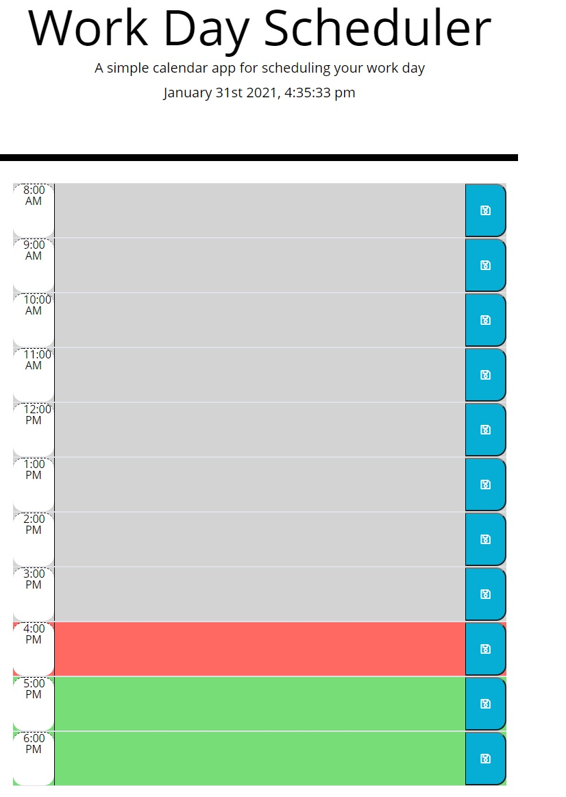
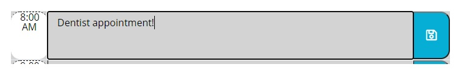

# Day Planner

```Goals for this project:```

1. Set up current date and time and display on the page
2. When the current time is greater than the time on the day planner it will be grey to represent past time
3. If the current time matches the time on the day player it will show red to represent present time
4. If the hour has not yet happened it will show green to represent future
5. Text box values will be saved to local storage and be viewable after the page has refreshed

## ```Challenges```

 The challenge for this project was thinking of an efficient way to simplify each task. I didn't want to have the same code repeated multiple times for different hours. So, I focused on loops for this project. I thought the best way was to loop through all of the hours listed from 8:00 am to 6:00pm and then give the ability to save
 and access the information.

 ## ```Screenshots```

The time will effect how the day planner will look by showing grey for the time that has already happened, red for the current time slot, and green for time that that hasn't happened yet.



Information typed into any box can be saved by pressing the blue save button.

Once the information has been saved the user can close their browser and access the information at a later time.




## ```Created by Andrew Boyle```
[Day Planner Link](https://andyb2.github.io/DayPlanner/)
    